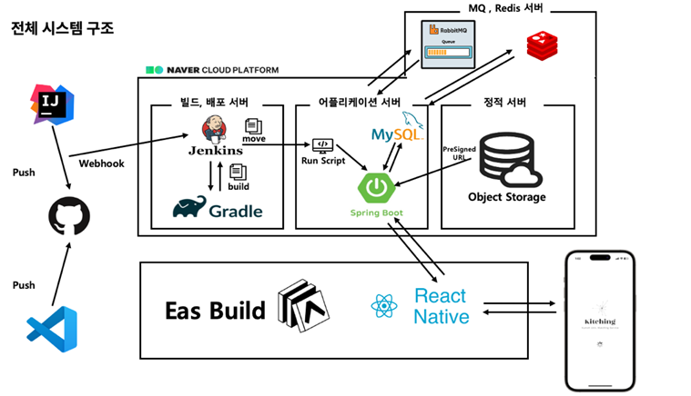
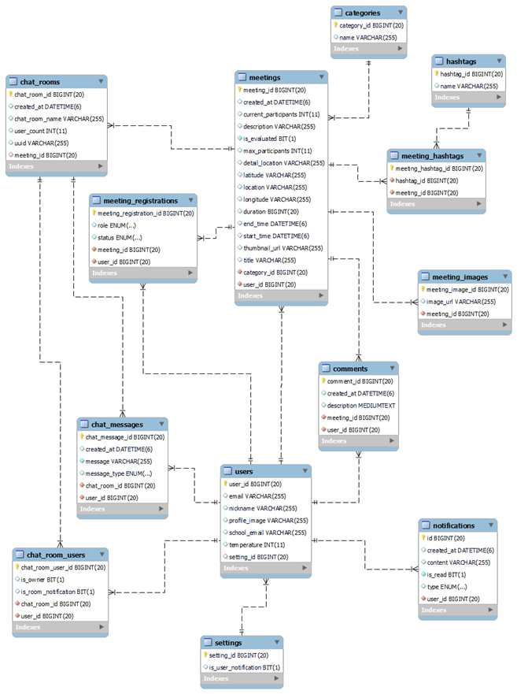

# Kitching - 우리를 위한 매칭 서비스

## 1. 프로젝트 소개

- 온라인에서 오프라인의 모임이 활발하게 잡히는 요즘, 우리 학교 학생들을 위한 **모바일 매칭 서비스**를 개발하였다.
- 사용자는 누구나 `모임`을 생성할 수 있으며, 그 `모임`에 누구나 참여할 수 있다.
- 길찾기 부터, 모임원 간 채팅까지 모임을 만들고 참여하기 위한 모든 기능을 제공한다, 따라서`Kitching`이라는 한 서비스 안에서 사용자는 모임에 필요한 모든 동작을 수행할 수 있다. 

 

## 2. 프로젝트 기능 설명

### 1. 시작 및 로그인
- 사용자는 **카카오 로그인**을 통해 최초 회원가입을 진행할 수 있다.
- 최초에 1번의 카카오 로그인 이외에는 자유롭게 서비스를 이용할 수 있다.

### 2. 모임 조회 / 검색 / 정렬 / 필터링
- 사용자는 메인 페이지, 추천 페이지를 통해 생성된 모임들을 조회할 수 있다.
- 상단의 검색바를 통해 해시태그 및 제목에 대한 검색을 수행할 수 있다.
- 또한 우측 상단의 드롭 다운을 선택하여 `임박한 순`, `가나다 순`, `최신순`으로 정렬 옵션을 선택할 수 있다.
- 상단의 카테고리 아이콘을 통해 자신이 찾고 싶은 카테고리를 선택하여 모임을 찾아볼 수 있다.
- 마이페이지를 통해 자신이 생성한 모임, 혹은 자신이 참여한 모임에 대해서도 조회를 할 수 있다.

### 3. 길찾기
- 모임에 대한 기능으로 `길찾기` 기능도 제공한다.
- `길찾기`는 현재 위치로부터 목적지 까지의 위치를 알 수 있다.

### 4. 모임 생성, 신청
- 사용자는 `모임을 생성하는 것`, 혹은 `기존에 있는 모임에 참여하는 것` 두 가지 선택을 할 수 있다.
- `방장`은 모임 시각, 장소, 제목, 내용 등의 위치를 기입함으로써 모임을 생성할 수 있다.
- `참여자`는 자신이 마음에 드는 모임에 대해서 `참가 신청`을 통해 모임에 참여 의사를 방장에게 밝힐 수 있다.

### 5. 모임 수락 및 관리
- `방장`은 자신이 생성된 모임의 신청 정보를 관리할 수 있다.
- `방장`은 신청 관리 페이지에서 사용자의 프로필을 보고 `수락`, 혹은 `거절`의 선택을 할 수 있다.
- `방장`이 수락한 `참여자`에 대해서는 해당 모임과 연동된 채팅방에 초대가 된다.

### 6. 모임 문의 및 채팅
- 모임에 참여하기전, 사용자는 궁금한 사항에 대해서는 모임에 `댓글`을 통해 문의 사항을 남길 수 있다.
- 모임에 참여한 후에는 `채팅방`에 입장하여, 모임에 필요한 대화를 나누거나 일정을 조율할 수 있다.

### 7. 메일 인증
- 사용자는 마이페이지에서 학교 인증 버튼을 통해 메일 인증을 진행할 수 있다.
- 사용자는 이메일을 기입한 후, 인증 코드를 입력함으로써 메일 인증을 완료할 수 있다.
- 메일 인증을 한 사용자에 대해서는 닉네임 옆에 `인증 마크`가 부여된다.

 

## 3. 기술 스택

| 클라이언트    | 서버        |
|-----------|-----------|
|  |  |
|           |  |
|           |  |
|           |  |

## 4. 아키텍처 구조

- 서버는 `네이버 클라우드 플랫폼`의 도움을 받아 운용하였다.
- 배포 자동화를 위한 `젠킨스 서버`, `어플리케이션 서버`, 이미지 저장을 위한 `정적 서버`, 그리고 메일 인증에서 사용할 `RabbitMQ, Redis 서버`로 운용했다.

 

## 5. ERD

- 사용자(users)와 모임(meetings)에 대한 관계 테이블들을 통해 사용자와 모임의 상호작용을 정의하고 관리하고 있다.

## 6. 시연 영상

